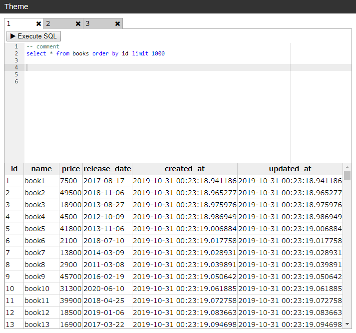

# Rsql

## Installation

Gemfile

```ruby
gem 'rsql', git: 'https://github.com/kmdtmyk/rsql'
```

## Usage

config/routes.rb

```ruby
Rails.application.routes.draw do
  mount Rsql::Engine => '/sql'
end
```

Open http://localhost/sql



## License

MIT
